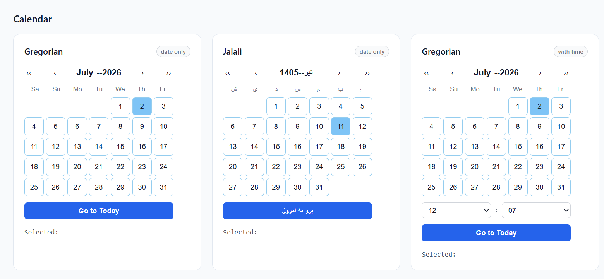
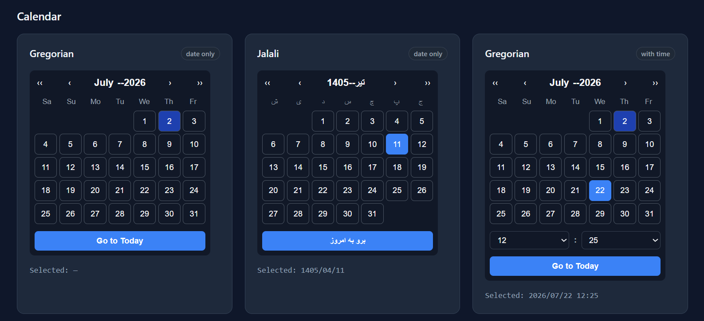
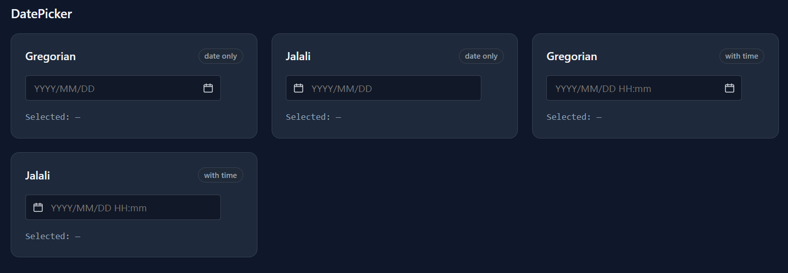

# React Calendar Picker

A lightweight **React + TypeScript** calendar and date-picker library with **Gregorian** and **Jalali** support, optional time selection, and **CSS-variable theming** — no Material UI or other UI framework required.

**Live demo:** Coming soon

## Why this project?

Most date pickers are either tied to a specific design system or only support the Gregorian calendar. This project focuses on:

- **Reusable architecture** — a shared calendar engine and two composable components (`Calendar`, `DatePicker`)
- **Gregorian & Jalali** — first-class support for both calendar systems
- **Optional time selection** — date-only or date-time in one component
- **External theme customization** — style via CSS variables on any wrapper; no `theme` prop lock-in
- **No UI library dependency** — plain React, TypeScript, and CSS modules

## Features

- `Calendar` — inline month grid with navigation and Today button
- `DatePicker` — input + popover built on `Calendar`
- Gregorian and Jalali calendars
- English (`en`) and Persian (`fa`) locale labels
- Optional time selection (`showTime`, `showSeconds`, `timeStep`)
- Controlled and uncontrolled usage
- Light/dark presets via `data-theme` and CSS variables
- Host-app theme overrides without component API changes
- TypeScript types for all public props and core types

## Demo screenshots

### Light mode Calendar



### Dark mode Calendar with time



### Dark mode DatePicker



## Installation / local setup

This project is **not published to npm**. Use the repository directly:

```bash
git clone https://github.com/mramirahmadi2/react-calendar-picker.git
cd react-calendar-picker
npm install
npm run dev
```

Open the Vite dev server URL to explore the interactive demo.

Build the demo app:

```bash
npm run build
npm run preview
```

### Importing components today

Until npm publish, import from `src/` (or copy the package into a monorepo):

```tsx
import { Calendar, DatePicker } from "./path-to/react-calendar-picker/src";
import type { CalendarDate } from "./path-to/react-calendar-picker/src";
import "./path-to/react-calendar-picker/src/styles/styles.css";
```

The usage examples below show the **planned package API** (`react-calendar-picker` imports) for when the library is published.

## Usage examples (planned package API)

> **Note:** `npm install react-calendar-picker` is not available yet. Examples use future package import paths. For local development, clone this repo and use `src/` imports as shown above.

## Project structure

```txt
src/
  components/
    Calendar/       # Inline calendar UI
    DatePicker/     # Input + popover
  core/
    calendars/      # Gregorian & Jalali engines
    experimental/   # Hijri (not stable)
  styles/           # calendar-theme.css, public styles.css
  utils/            # conversions, localization helpers
  index.ts          # Public API barrel
```

## Basic Calendar usage

```tsx
import { useState } from "react";
import { Calendar } from "react-calendar-picker";
import type { CalendarDate } from "react-calendar-picker";

function MyCalendar() {
  const [date, setDate] = useState<CalendarDate | null>(null);

  return (
    <Calendar
      calendar="gregorian"
      locale="en"
      value={date}
      onChange={setDate}
    />
  );
}
```

## Basic DatePicker usage

```tsx
import { useState } from "react";
import { DatePicker } from "react-calendar-picker";
import type { CalendarDate } from "react-calendar-picker";

function MyDatePicker() {
  const [date, setDate] = useState<CalendarDate | null>(null);

  return (
    <DatePicker
      calendar="gregorian"
      locale="en"
      value={date}
      onChange={setDate}
      placeholder="YYYY/MM/DD"
    />
  );
}
```

## Jalali example

```tsx
<Calendar
  calendar="jalali"
  locale="fa"
  value={date}
  onChange={setDate}
  weekStartsOn={0}
/>

<DatePicker
  calendar="jalali"
  locale="fa"
  value={date}
  onChange={setDate}
  placeholder="YYYY/MM/DD"
/>
```

## Time selection example

```tsx
<Calendar
  calendar="gregorian"
  locale="en"
  value={date}
  onChange={setDate}
  showTime
  timeStep={5}
/>

<DatePicker
  calendar="jalali"
  locale="fa"
  value={date}
  onChange={setDate}
  showTime
  showSeconds={false}
  placeholder="YYYY/MM/DD HH:mm"
/>
```

When `showTime` is enabled, `CalendarDate` may include `hour`, `minute`, and optionally `second`.

## Controlled usage

Pass `value` and `onChange` — the parent owns the selected date:

```tsx
const [date, setDate] = useState<CalendarDate | null>(null);

<DatePicker value={date} onChange={setDate} calendar="gregorian" locale="en" />
```

`DatePicker` `onChange` receives `CalendarDate | null` when cleared (if `clearable`).

## Uncontrolled usage

Pass `defaultValue` and optionally `onChange` — the component manages its own state:

```tsx
<DatePicker
  defaultValue={{ year: 1404, month: 1, day: 1 }}
  calendar="jalali"
  locale="fa"
  onChange={(date) => console.log(date)}
/>
```

## Theme customization with CSS variables

Components read `--calendar-*` variables. Override them on any ancestor:

```css
.myForm {
  --calendar-selected-bg: #7c3aed;
  --calendar-selected-text: #ffffff;
  --calendar-today-bg: #ddd6fe;
}
```

```tsx
<div className="myForm">
  <DatePicker calendar="jalali" locale="fa" />
</div>
```

Available variables include:

| Variable | Purpose |
|----------|---------|
| `--calendar-bg` | Panel / input background |
| `--calendar-text` | Primary text |
| `--calendar-muted` | Secondary text |
| `--calendar-border` | Borders |
| `--calendar-surface` | Subtle surfaces |
| `--calendar-hover` | Hover state |
| `--calendar-today-bg` / `--calendar-today-text` | Today highlight |
| `--calendar-selected-bg` / `--calendar-selected-text` | Selected day |
| `--calendar-shadow` | Popover shadow |
| `--calendar-icon` | DatePicker icon color |

Component CSS modules include light-theme fallbacks when variables are not set.

## Light / dark theme usage

After npm publish, import the bundled theme presets:

```ts
import "react-calendar-picker/styles.css";
```

Until then, import from source:

```ts
import "./path-to/react-calendar-picker/src/styles/styles.css";
```

Set `data-theme` on `<html>` or a container:

```tsx
// React toggle example
useEffect(() => {
  document.documentElement.setAttribute("data-theme", theme);
}, [theme]);
```

```ts
document.documentElement.setAttribute("data-theme", "dark");
```

## Calendar props

| Prop | Type | Default | Description |
|------|------|---------|-------------|
| `calendar` | `"gregorian" \| "jalali"` | `"gregorian"` | Calendar system |
| `locale` | `"en" \| "fa"` | `"en"` | Month/weekday labels |
| `value` | `CalendarDate \| null` | — | Controlled selected date |
| `defaultValue` | `CalendarDate \| null` | — | Initial date (uncontrolled) |
| `onChange` | `(date: CalendarDate) => void` | — | Called when date/time changes |
| `weekStartsOn` | `0`–`6` | `0` | First column (0 = Saturday) |
| `className` | `string` | — | Root class name |
| `showTime` | `boolean` | `false` | Show time selectors |
| `showSeconds` | `boolean` | `false` | Include seconds when `showTime` |
| `timeStep` | `number` | `1` | Step value for minute and second dropdowns |

## DatePicker props

Includes all **Calendar** props above (except `className` applies to the root wrapper), plus:

| Prop | Type | Default | Description |
|------|------|---------|-------------|
| `onChange` | `(date: CalendarDate \| null) => void` | — | Called on select or clear |
| `placeholder` | `string` | — | Input placeholder |
| `disabled` | `boolean` | `false` | Disable input |
| `readOnly` | `boolean` | `false` | Read-only input |
| `clearable` | `boolean` | `false` | Show clear button |
| `inputClassName` | `string` | — | Input element class |
| `popoverClassName` | `string` | — | Popover panel class |

## Core types

```ts
interface CalendarDate {
  year: number;
  month: number;
  day: number;
  hour?: number;
  minute?: number;
  second?: number;
}

type CalendarType = "gregorian" | "jalali";
type Locale = "en" | "fa";
type WeekStartsOn = 0 | 1 | 2 | 3 | 4 | 5 | 6;
```

## Supported calendars

| Calendar | Status | Notes |
|----------|--------|-------|
| Gregorian | **Stable** | Default calendar |
| Jalali (Persian / Shamsi) | **Stable** | Full UI + conversion support |
| Hijri | **Experimental** | Under `core/experimental/`; exported as `createExperimentalHijriCalendar` — not part of the stable API |

## Public API exports

From `src/index.ts`:

**Stable:** `Calendar`, `CalendarProps`, `DatePicker`, `DatePickerProps`, `createCalendar`, `GregorianCalendar`, `JalaliCalendar`, `CalendarType`, `Locale`, `CalendarDate`, `WeekStartsOn`, `CalendarEngine`, `DateRange`

**Experimental:** `createExperimentalHijriCalendar`, `ExperimentalHijriCalendar`, `ExperimentalCalendarType`, `ExperimentalHijriOptions`

## Current limitations

- Not yet published to npm (source imports only)
- No date range picker
- No min/max date constraints
- No disabled-date rules
- Hijri is experimental and not integrated in `Calendar` / `DatePicker`
- Accessibility polish (focus trap, full keyboard grid navigation) is minimal
- i18n is limited to `en` / `fa` label sets

## Package status

| Item | Current state |
|------|----------------|
| npm publish | **Not yet** — `private: true` in `package.json` |
| `exports["."]` | `./src/index.ts` (temporary; will point to `dist` before publish) |
| `exports["./styles.css"]` | `./src/styles/styles.css` |
| Demo build | `npm run build` → Vite app in `dist/` (not a library bundle) |

## Release checklist

Before sharing on GitHub and LinkedIn:

- [x] Replace the GitHub username placeholder in `package.json` and `README.md`
- [ ] Add screenshots under `docs/images/` and embed them in the Demo screenshots section
- [ ] Deploy live demo (GitHub Pages, Vercel, or Netlify)
- [ ] Replace **Live demo: Coming soon** with the deployed URL
- [ ] Post on LinkedIn (repo link + live demo + short screen capture)

## Roadmap

- [ ] Library build (`dist`) and npm publish
- [ ] Live demo deployment — see [Release checklist](#release-checklist)
- [ ] Disabled dates and min/max bounds
- [ ] Date range selection
- [ ] Improved accessibility
- [ ] Optional Hijri promotion after stabilization

## License

MIT — see [LICENSE](LICENSE).
